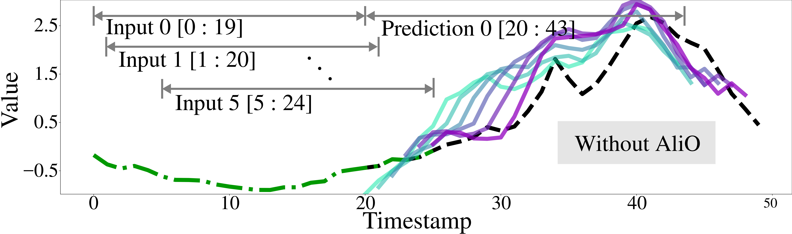
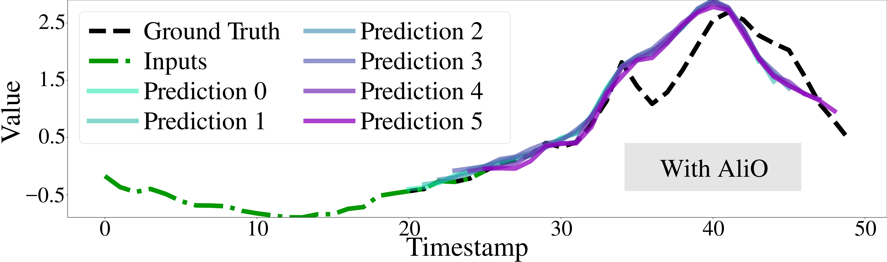
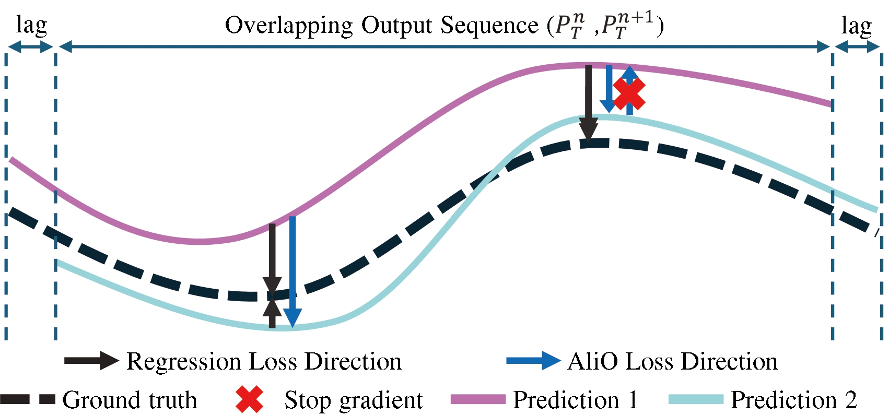
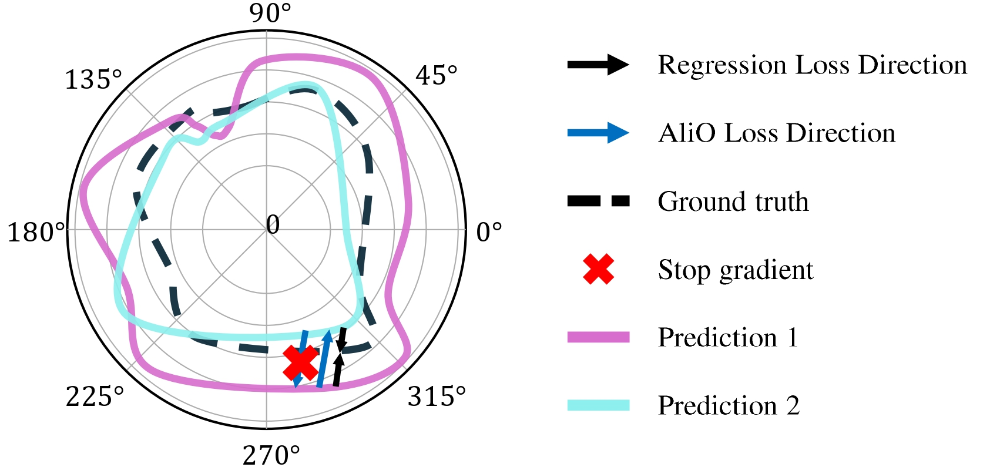

# [NeurIPS 2025] AliO: Output Alignment Matters in Long-Term Time Series Forecasting
   

Official implementation of <a href="https://neurips.cc/virtual/2025/poster/119426">AliO</a>

Official presentation of author (Kwangryeol Park): <a href="https://recorder-v3.slideslive.com/?share=103427&s=a11017bd-12a5-4c9a-b667-2babc3fdfab2">SlidesLive</a>

# Abstract
Long-term Time Series Forecasting (LTSF) is crucial in real-world applications like weather forecasting and electricity consumption planning. However, state-of-the-art LTSF models often suffer from the 'output alignment problem,' where predictions for the same future timestamp fluctuate when made from slightly different input sequences (lagged inputs). This inconsistency undermines the model's reliability. To address this, we propose AliO (Align Outputs), a novel approach designed to improve the output alignment of LTSF models by reducing discrepancies between predictions for the same timestamps in both the time and frequency domains. We also introduce a new metric, TAM (Time Alignment Metric), to quantify output alignment. Experimental results show that AliO significantly improves output alignment (up to 58.2% in TAM) while maintaining or enhancing forecasting performance (up to 27.5%).

# The Output Alignment Problem
A reliable forecasting model should provide consistent predictions for a specific future point, even with slight variations in the input data. However, as shown in the figure below, a prediction for August's power demand using data from January-March (Prediction 1) can differ from a prediction for the same month using data from February-April (Prediction 2). This discrepancy can lead to unnecessary costs, such as budget rescheduling, and erodes trust in the model.

AliO is proposed to solve this output alignment problem. The figure below compares the prediction results of a model using only the conventional method (MSE Loss) versus one applying AliO. With AliO, the predictions from multiple input sequences (green dotted lines) are much more consistently aligned and closer to the ground truth.

<p align="center">   </p>
    
<p align="center"> Figure 2: An example of low output alignment (Without AliO) and high output alignment (With AliO) between six predictions for the same future period, predicted from 6 overlapping input sequences.</p>

# Our Solution AliO
AliO is designed to enhance output alignment by minimizing the discrepancy between overlapping predictions in both the time and frequency domains. As illustrated in Figure 3, AliO aligns two predictions (Prediction 1 - Prediction N) with each other.

A key component of our method is Regression Pulling (RegPull). This technique ensures that improving alignment does not hurt the model's overall forecasting accuracy. At each timestamp, RegPull identifies which prediction is further from the ground truth. By applying a stop-gradient operation to the farther point, the alignment loss pulls the errant prediction closer to the more accurate one, effectively reinforcing the direction of the main regression loss. This process is applied in both the time domain (aligning temporal patterns) and the frequency domain (aligning phase and amplitude components).

<p align="center">   </p>
    
<p align="center"> Figure 3: An illustration of how AliO aligns predictions in the time (left or top) and frequency (right or bottom) domains. The stop-gradient (red 'x') operation ensures that the alignment process also pulls predictions toward the ground truth. </p>


# How to use
* Install AliO using
```
pip install -e .
```

* Import AliO
```
from alio import AliO

alio_loss = AliO(
    num_samples=2,
    lag=1,
    time_loss='mse',
    freq_loss='mse'
)
```

# Implementation repository
AliO can be easily integrated into various state-of-the-art LTSF models, and we have verified its performance improvements on the following:
* <a href="examples/CycleNet">CycleNet</a>
* <a href="examples/TimesNet">TimesNet</a>
* <a href="examples/iTransformer">iTransformer</a>
* <a href="examples/GPT2">GPT4TS</a>
* <a href="examples/PatchTST">PatchTST</a>
* <a href="examples/DLinear">DLinear</a>
* <a href="examples/Autoformer">Autoformer</a>

# Citation
```
@inproceedings{park2025alio,
  title={AliO: Output Alignment Matters in Long-Term Time Series Forecasting},
  author={Kwangryeol Park and Jaeho Kim and Seulki Lee},
  booktitle={Thirty-ninth Conference on Neural Information Processing Systems},
  year={2025},
  url={https://openreview.net/forum?id=AuOZDp4gy7}
}
```
